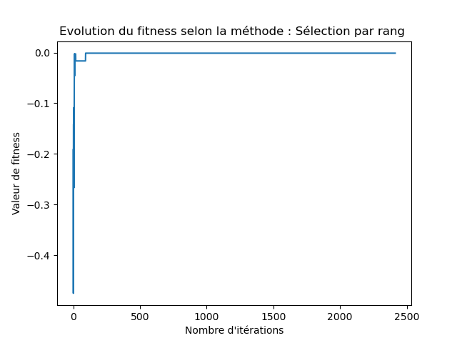
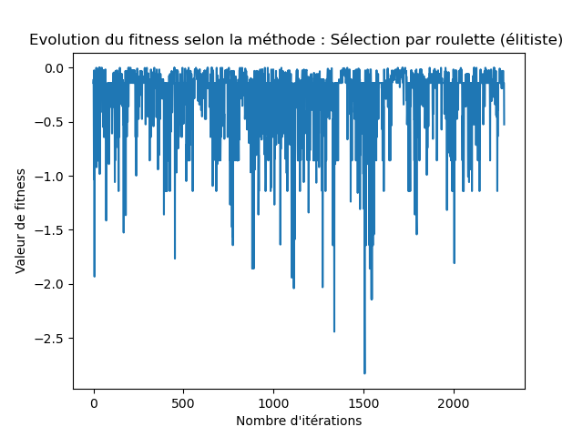
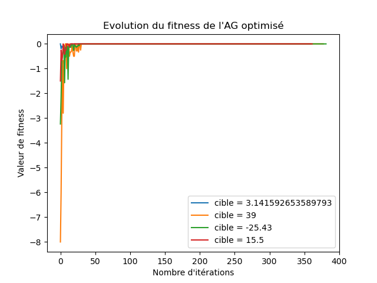

# Préambule

## Introduction

L'intelligence artificielle, dont la popularité n'a fait qu'augmenter au cours des dernières décennies [@cardillo-2023], est aujourd'hui utilisée dans des domaines aussi variés que la médecine, la finance ou même l'agriculture [@marr-2023].

Les algorithmes génétiques font parties de l'ensemble des algorithmes évolutionnistes, inspirés par certains principes biologiques et en particulier de la théorie de l'évolution. Ils permettent de générer une population de solutions potentielles qui va évoluer au fil des générations dans l'optique que les individus soient toujours plus aptes à résoudre le problème donné. [@genetic-algo;@evol-algo]

Les principes de bases sont la reproduction (deux parents donnent des enfants dont la patrimoine génétique est constitué de celui des parents), la mutation (modification aléatoire d'un ou plusieurs gènes) et la sélection (élimination des individus les moins adaptés). 

## Contexte

Il est demandé d'implémenter un algorithme génétique afin de résoudre le jeu "*Le compte est bon*" en Python. Le principe du jeu est le suivant :  A l'aide des nombres entiers de 0 à 9 et des opérateurs mathématiques de base (addition, soustraction, multiplication et division), trouver une suite de nombres et d'opérateurs permettant d'atteindre une cible numérique donnée. 

Chaque individu représente une suite de nombre et d'opérateurs. Un individu est représenté par son chromosome qui est une suite de gènes. Chaque gène représente un nombre, un opérateur ou un gène invalide (qui ne contribue pas au calcul). Chaque gène est encodé par une suite de 4 symboles 1 ou 0 (encodage binaire). 

## Objectifs

Ce document a pour but de décrire le travail effectué ainsi que les choix qui l'y ont mené. 


# Implémentation {#sec:impl}

## Introduction

L'implémentation est intégralement effectuée au sein d'un unique script Python qui a été fourni par l'enseignant au début de travail. Les signatures des fonctions qui étaient initialement présentes n'ont pas été changées. 

La manière dont sont effectuées les opérations génétiques de base (sélection, reproduction et mutation) peut être modifiée à l'aide de plusieurs variables globales. Cette méthodologie permet d'étendre les fonctionnalité du programme sans pour autant changer les signatures proposées. 

## Encodage des individus

La correspondance entre le symbole (nombre ou opérateur) et l'encodage du gène est celle proposée par l'enseignant, représenté dans la @tbl:encoding.

| Symbole | Encodage |
| :-----: | -------- |
|    0    | `0000`   |
|    1    | `0001`   |
|    2    | `0010`   |
|    3    | `0011`   |
|    4    | `0100`   |
|    5    | `0101`   |
|    6    | `0110`   |
|    7    | `0111`   |
|    8    | `1000`   |
|    9    | `1001`   |
|   `+`   | `1010`   |
|   `-`   | `1011`   |
|   `*`   | `1100`   |
|   `/`   | `1101`   |

: Encodage binaire des nombres et des opérations {#tbl:encoding}

Dans l'implémentation, chaque individu est alors représenté par son chromosome qui est une **chaîne de caractères**, dont la taille est un multiple de 4. Une population est un ensemble d'individus et est représentée par une liste de chaîne de caractères. 

Les deux codes `1110` et `1111` ne sont pas utilisés et sont considérés comme invalides. 

## Décodage {#sec:decodage}

### Principe

La fonction de décodage permet de convertir un chromosome en une représentation humaine. Celle-ci est constituée de la suite des nombres et des opérateurs encodés par le chromosome, en ignorant les opérations invalides. 

### Opérations invalides

Au fil des reproductions et des mutations aléatoires, des symboles ou des suite d'opérations invalides peuvent apparaitre. Par exemple, les deux codes inutilisés ne sont pas valides. Mais aussi, on considère qu'une suite d'opérations valide est de la forme : 
$$
x_0 \Lambda_1 x_1 \Lambda_2 x_2 \dots x_{n-1}\Lambda_n x_n
$$
Où $x_1\dots x_n$ sont les nombres et $\Lambda_1\dots \Lambda_n$ sont les opérateurs. 

Ainsi, dans le cas où deux nombres ou opérateurs (ou plus) se suivent, l'opération n'a pas de sens. Dans l'implémentation actuelle, la première occurence d'un type de symbole valide est retenue et les symboles invalides suivants sont ignorés jusqu'à ce que l'autre type apparaisse. 

Par exemple, l'opération : 
$$
x_1 \Lambda_1 \Lambda_2 x_2 x_3\Lambda_3
$$
est interprétée de la manière suivante : 
$$
x_1 \Lambda_1 x_2
$$

### Division par zéro 

La division par zéro est également un cas spécial qui risque d'apparaitre et qu'il faut traiter. Afin de simplifier l'implémentation, il a été choisi **d'ignorer** les divisions par zéro. Cela veut dire que cette opération est traitée de la même manière que les opérations invalides. 

Par exemple, l'opération : 
$$
x_1 \Lambda_1 0 \Lambda_2 x_3 \quad, \Lambda_1 \equiv \mbox{ "division"}
$$
Devient :
$$
x_1 \Lambda_2 x_3
$$


### Fonction

La fonction reçoit un chromosome sous forme de chaîne de caractères et retourne le décodage en représentation humaine, également sous forme de chaîne de caractères. Chaque symbole est séparé du suivant par la caractère *espace*. 

## Evaluation

### Principe

L'évaluation du chromosome consiste à obtenir le résultat des opérations (valides) qui le constitue, sous la forme d'un nombre réel. C'est ce résultat qui devra converger vers la cible donnée. 

### Implémentation

La fonction va utiliser le résultat retourné par le décodage (c.f. @sec:decodage). La chaîne de caractère qui est retournée va être divisée à chaque *espace* pour en former une liste. Chacun des éléments de la liste est soit un nombre compris entre 0 et 9 sous forme de caractère, soit un des caractères `+`, `-`, `*` ou `/`. 

Les nombres peuvent être convertis en un entier à l'aide de la fonction Python `int()`. Les opérateurs sont lié à une fonction grâce à un dictionnaire qui permet d'effectuer l'opération correspondante. Le code constituant le dictionnaire est montré dans le @lst:lambda. En cas de division par zéro (qui ne devrait jamais arriver), la fonction division renvoie *NaN*. 

```{#lst:lambda .py caption="Dictionnaire qui fait correspondre l'opérateur à une fonction"}
operations = {
    '+': lambda x, y: x + y,
    '-': lambda x, y: x - y,
    '*': lambda x, y: x * y,
    '/': lambda x, y: x / y if y != 0 else float('nan')
}
```

Chacun des éléments de la liste est donc ainsi interprété et un résultat numérique réel en est obtenu.

## Fitness

### Principe

Une fonction de fitness permet d'évaluer l'efficacité d'une solution. Elle fait correspondre un individu et un score, représenté par un nombre réel. Plus cette valeur est élevée, plus la solution que représente l'individu est efficace.

### Implémentation

La fonction va commencer par évaluer le chromosome pour obtenir la valeur de la solution. Ensuite, l'opposé de la différence entre la valeur de la solution et celle de la cible est retournée. 
$$
\mathrm{fitness}(x, A) = - \left| \mathrm{eval}(x) - A \right|
$$
où $x$ est le chromosome et $A$ est la cible. 

La valeur de fitness d'une solution réduit ainsi **linéairement** par rapport à sa distance à la cible. 

D'autres approches existent, telles que les fonctions quadratiques, exponentielles ou logarithmiques, mais elles n'ont pas été explorées dans le cadre de ce travail. 

## Croisement

### Principe

Le croisement entre deux chromosome consiste à la génération de chromosomes enfants dont le patrimoine génétique est constitué de celui des deux parents. 

### Implémentation

Trois méthodes différentes détaillées dans les paragraphes suivants ont été implémentées. Le croisement retourne toujours exactement deux enfants. Afin de simplifier l'implémentation, il a été décidé de supposer que les deux chromosomes parents sont toujours de taille égale.

#### Découpage en $n$ parties

Le principe est le suivant : Le chromosome de chacun des deux parent est divisé en $n$ parties de taille égale. Ensuite, le premier enfant prend la première partie du premier parent, la deuxième partie du deuxième parent, la troisième partie du premier parent et ainsi de suite. 

C'est la même chose pour le deuxième enfant mais dans l'autre sens. 

#### Echange tous les $n$ bits {#sec:crossnbits}

Au lieu de découper le chromosome en $n$ parties, on découpe le chromosome et on fait un échange tous les $n$ bits. 

#### Echange tous les $n$ gènes

C'est le même principe que la méthode @sec:crossnbits, mais on échange tous les $n$ gènes au lieu des $n$ bits.

### Croisement d'une population

Le croisement de la population consiste à créer une nouvelle génération constituée des enfants de la génération courante. Dans l'implémentation actuelle, à chaque croisement, la taille de la population double. Cela permet de diviser la taille de la population par un facteur 2 lors de la sélection.

Pour effectuer cette opération, une liste contenant l'intégralité de la population est mélangée, puis le premier élément est croisé avec le second, le second avec le troisième et ainsi de suite. Le dernier élément de la liste est croisé avec le premier. 

Cela permet d'effectuer un croisement de population de manière aléatoire, sans pour autant effectuer deux fois le même croisement (sauf si des doublons existent déjà dans la population). Chaque chromosome est donc croisé avec ses deux voisins. 

## Mutation

### Principe

La mutation d'un chromosome est un principe fondamental des algorithmes génétiques. Elle permet de diversifier la population et d'apporter des solutions originales. 

Lorsque qu'un bit du chromosome est muté, sa valeur est inversée. Cela signifie que s'il valait 1, il vaudra maintenant 0 et vice-versa. 

Quatre méthodes de mutations ont été implémentées. Pour chacune d'elles, il est possible de choisir un paramètre $n$ qui correspond au taux de modification du chromosome muté et de l'incidence de mutation. L'incidence correspond à la probabilité qu'a un chromosome d'être muté. 

### Inversion de $n$ bits

Cette méthode va aléatoirement sélectionner $n$ bits du chromosome et va inverser leur valeur. 

### Inversion de 1 bit sur $n$ gènes

Cette méthode va aléatoirement sélectionner $n$ gènes à muter, et que sur chacun d'entre eux, elle va sélectionner aléatoirement un seul bit qui sera inversé. 

### Inversion de tous les bits sur $n$ gènes

Cette méthode va aléatoirement sélectionner $n$ gènes à muter, et que sur chacun d'entre eux, elle va inverser tous les bits qui le constitue. 

### Mélange des bits de $n$ gènes

Cette méthode va aléatoirement sélectionner $n$ gènes à muter. Ensuite, pour chacun d'entre eux, elle va changer l'ordre des bit qui le constitue, de manière aléatoire. 

## Sélection

### Principe

La sélection permet de ne garder que les individus les plus adaptés, et d'éliminer les autres. Les individus sélectionnés auront le privilège de se croiser entre eux afin de créer la génération suivante. Cela permet à la population de s'améliorer au fil du temps.

Il a été choisi que la sélection ne garde que la moitié des individus, afin que le croisement double la taille de la population. De cette manière, le nombre d'individu reste stable à chaque itération. 

Toutes les méthodes sont enrichis d'un mode *élitiste*. Cela signifie que si le mode est activé, la sélection garde dans tous les cas le meilleur individu. 

### Sélection uniforme

Cette méthode va aléatoirement sélectionner 50% des individus. Une mauvaise solution a donc autant de chance d'être sélectionnée qu'une bonne solution. 

L'implémentation est effectuée de la manière suivante : On mélange une liste contenant la population et on retourne la première moitié de la liste mélangée. 

### Sélection par rang

Cette méthode va sélectionner la moitié la plus adaptée de la population. Cela signifie qu'on en choisit que les individus ayant les meilleurs valeurs de fitness et que tous les autres sont éliminés. 

Le désavantage de cette méthode est sa convergence vers un maximum local au détriment des autres solutions potentielles. 

L'implémentation est effectuée de la manière suivante : On trie une liste contenant la population selon leur valeur de fitness et on retourne la première moitié de la liste triée. 

### Sélection par tournois

Cette méthode va aléatoirement former des paires de chromosome qui vont ensuite *combattre* : celui qui possède une meilleure valeur de fitness va survivre, l'autre va être éliminé. 

L'implémentation est effectuée de la manière suivante : On forme aléatoirement des paires de chromosome sous forme de tuple. Puis on itère sur une liste contenant toutes les paires pour ajouter à la population sélectionnée le chromosome qui possède le meilleur fitness.

### Sélection par roulette

Cette méthode va aléatoirement choisir les chromosomes survivants en fonction de leur valeur de fitness : plus elle est élevée, plus l'individu a de chance d'être sélectionné. 

L'implémentation est plus complexe. Nous utilisons la méthode `random.choices()` , avec les paramètres `weights` et `k`.  Le paramètre `weights` permet de donner une liste de poids de probabilités, dans notre cas, les scores des chromosomes. Le paramètre `k` représente le nombre d'individu à sélectionner, en l'occurence, la taille de la population divisée par deux. 

Le problème est que notre fonction de fitness retourne des valeurs négatives alors que les poids de la fonction doivent être positifs. Pour remédier à ce problème, on ajoute un décalage constant aux scores. On récupère la plus petite valeur de score et on effectue à tous le monde le décalage de cette valeur, en ajoutant 1. De cette manière, le plus petit score vaudra 1 et tous les autres seront plus grand que 1 et donc positifs. 

# Analyse {#sec:analyse}

## Introduction

Comme vu dans la @sec:impl, plusieurs méthodes ont été implémentées, que ce soit pour la mutation, la sélection ou le croisement. De plus, chacune d'entre elles peuvent être ajustées avec un ou plusieurs paramètres. 

Dans cette section, les différentes fonctionnalités sont évaluées afin d'en déduire les méthodes et les paramètres les plus efficaces. 

Etant donné la quantité de réglages possibles, il n'est pas possible de tester toutes les méthodes avec tous les paramètres possibles en même temps sur un même référentiel. On se retrouverait avec des centaines de graphes différents qui deviendraient alors illisibles.

Alors, des méthodes et des paramètres standards fixes ont été définis (c.f. @sec:param), puis chacun d'entre eux va être modifié, l'un après l'autre, et le résultat obtenu sera analysé. De cette manière, une seule variable est analysée à chaque fois. 

## Paramètres standards {#sec:param}

| Paramètre             | Valeur                                                   |
| --------------------- | -------------------------------------------------------- |
| Cible                 | $\pi$                                                    |
| Méthode de mutation   | Inversion de 1 bit sur 5 gènes avec une incidence de 30% |
| Méthode de sélection  | Tournoi élitiste                                         |
| Méthode de croisement | Echange de 4 parties                                     |
| Nombre de gènes       | 30                                                       |
| Taille de population  | 50                                                       |
| Limite de temps [s]   | 10                                                       |

## Méthode de mutation

### Introduction

Dans cette section, les trois méthodes de mutations sont testées et analysées.

### Résultats

#### Méthode

Sur la @fig:plot-mutation-method est représentée l'évolution de la valeur de fitness du meilleur individu en fonction du nombre d'itérations, selon la méthode de mutation utilisée. 

On en déduit que les méthodes les plus efficaces sont l'inversion de 5 bits ou d'un bit sur 5 gènes. 

La mutation trop importante du chromosome fait fortement varier l'efficacité de la population ou l'empêche de s'améliorer.

{#fig:plot-mutation-method}

#### Nombre de gènes affectés

Sur la @fig:plot-mutation-x est représentée l'évolution de la valeur de fitness du meilleur individu en fonction du nombre d'itérations, selon le nombre de gènes affectés par la mutation. 

On remarque clairement qu'un trop grand nombre de gènes mutés font drastiquement varier la performance des individus (en rouge), tandis qu'un trop faible nombre de gènes mutés font stagner la performance à une valeur inférieure (en bleu). 

On en conclut que la meilleure stratégie est de muter environ 10% des gènes. 

{#fig:plot-mutation-x}

#### Incidence

Sur la @fig:plot-mutation-i est représentée l'évolution de la valeur de fitness du meilleur individu en fonction du nombre d'itération, selon le taux d'incidence de mutation. Ce chiffre correspond à la probabilité qu'a un chromosome d'être muté. 

On remarque qu'un trop grand nombre de chromosome mutés (> 75%) implique une forte variation de la performance. 

Il faut donc que le taux de mutation reste inférieur à 50% pour de meilleurs résultats.

{#fig:plot-mutation-i}

### Discussion

On remarque bien sur les résultats que trop de mutation nuit à la performance de la population, tandis que trop peu empêche à la population de se diversifier. L'équilibre qu'il faut trouver fait partie de la complexité de ce problème. 

**Selon ces résultats, il a été choisi la méthode de mutation suivante : inversion de 1 bit de 10% des gènes avec une incidence de 30%.** 

## Méthode de sélection

### Introduction

### Résultats

#### Sélection uniforme

Sur la @fig:plot-selection-uniform est représentée l'évolution de la valeur de fitness du meilleur individu en fonction du nombre d'itérations avec la sélection uniforme. 

{#fig:plot-selection-uniform width=10cm}

On remarque que la méthode converge difficilement et que l'efficacité varie fortement entre deux générations. 

#### Sélection par rang

Sur la @fig:plot-selection-rank est représentée l'évolution de la valeur de fitness du meilleur individu en fonction du nombre d'itérations avec la méthode de sélection par rang.

{#fig:plot-selection-rank width=10cm}

On remarque que cette méthode converge rapidement vers maximum local et ne s'en éloigne pas. 

#### Sélection par tournoi

Sur la @fig:plot-selection-tournament-e est représentée l'évolution de la valeur de fitness du meilleur individu en fonction du nombre d'itérations avec la méthode de sélection par tournois en mode élitiste et sur la @fig:plot-selection-tournament en mode non-élitiste.

{#fig:plot-selection-tournament-e width=10cm}

{#fig:plot-selection-tournament width=10cm}

On remarque que la convergence s'effectue assez rapidement. La méthode élitiste converge légèrement plus rapidement. 

#### Sélection par roulette

Sur la @fig:plot-selection-roulette-e est représentée l'évolution de la valeur de fitness du meilleur individu en fonction du nombre d'itérations avec la méthode de sélection par roulette en mode élitiste et sur la @fig:plot-selection-roulette en mode non-élitiste.

{#fig:plot-selection-roulette-e width=10cm}

{#fig:plot-selection-roulette width=10cm}

La méthode par roulette converge difficilement. Pourtant, elle devrait être au moins aussi efficace que la sélection par tournoi. Une raison qui peut expliquer ce résultat est l'implémentation de la fonction en Python. En effet, il a été nécessaire d'effectuer un décalage des scores pour avoir des valeurs positives et et les valeurs de fitness évoluent linéairement. Des solutions plus éloignées auront une valeur de fitness proche de bonnes solutions et auront donc presque la même chance d'être sélectionnées. Cela revient donc à effectuer une sélection uniforme. 

Pour que cette méthode soit réellement efficace, il faudrait adapter la fonction de fitness ou la méthode de sélection par roulette. 

### Discussion

Il est clair que les méthodes de sélection uniforme et par roulette sont peu efficace en raison de la difficulté qu'elles ont à converger vers une solution. 

La sélection par rang converge rapidement, mais elle élimine directement les solutions moins efficaces. Elle converge donc vers un maximum local mais d'autres solutions qui sont meilleures peuvent exister. 

La sélection par tournoi a pour avantage de résoudre ce problème. La version élitiste permet de converger légèrement plus rapidement. 

**C'est donc la méthode de sélection par tournoi élitiste qui a été choisie pour la version optimisée de l'algorithme.** 

## Méthode de croisement

### Introduction

### Résultats

Sur la @fig:plot-crossover est représentée l'évolution de la valeur de fitness du meilleur individu en fonction du nombre d'itérations selon la méthode de croisement. 

{#fig:plot-crossover width=10cm}

### Discussion

Les 5 méthodes de croisement différentes qui ont été testée donnent des résultats très similaires. Finalement, peu importe comment la séparation des chromosomes des parents est effectuée, chaque enfant en reçoit 50%. Dans le cas où la population n'est pas trop diversifiée, ce qui tend arriver au fil des itérations, les deux parents sont relativement semblables. 

**De ce constat, il a été choisi d'utiliser la méthode de croisement en échangeant 4 parties, pour la version optimisée de l'algorithme.** 

## Nombre de gènes

### Introduction

Dans cette section, on s'intéresse à la relation qui existe entre le nombre de gènes qui composent un chromosome et l'efficacité de l'algorithme, tant au niveau du temps que la précision du résultat. 

### Résultats

Sur la @fig:plot-nb-genes est représentée l'évolution de la valeur de fitness du meilleur individu en fonction du temps selon le nombre de gènes que possède chaque chromosome. 

{#fig:plot-nb-genes width=10cm}

### Discussion

On remarque qu'un trop faible nombre de gènes a pour effet d'empêcher de trouver une solution assez précise. un grand nombre de gènes permet une plus grande liberté et une plus grande diversité mais rend les l'algorithme beaucoup plus lent. Il faut donc plus de temps pour converger vers une bonne solution. 

Il faut donc choisir suffisamment de gène pour avoir une population diversifiée qui permette de trouver une solution précise mais pas trop pour ne pas ralentir l'algorithme. 

**De ce constat, il a été choisit d'encoder chaque individu sur 100 gènes pour la version optimisée de l'algorithme.** 

## Taille de la population

### Introduction

Dans cette section, on s'intéresse à la relation qui existe entre le nombre d'individus qui composent une population et l'efficacité de l'algorithme. 

### Résultats

Sur la @fig:plot-population-size est représentée la valeur de fitness du meilleur individu à la fin de l'AG en fonction de la taille de la population.

{#fig:plot-population-size width=10cm}

### Discussion

On remarque que s'il y a trop peu d'individu, la précision du résultat varie entre plusieurs tests. Alors que quand le nombre d'individu est plus grand, les variations sont quasi-inexistantes. Toutefois, une taille de population plus élevée implique un plus grand nombre de calculs à effectuer à chaque itération et donc un temps plus grand nécessaire à la convergence vers une bonne solution. 

On remarque toutefois qu'à partir d'une centaine d'individu, les résultats semblent être bons et ne pas trop varier. **C'est de ce constat que la taille de la population a été choisie à 200 individus pour la version optimisée de l'algorithme.** 

## Algorithme optimisé

### Paramètres

Selon l'analyse qui a été effectuée, les paramètres représentés dans la @tbl:opti ont été choisis. 

| Paramètre             | Valeur                                                       |
| --------------------- | ------------------------------------------------------------ |
| Méthode de mutation   | Inversion de 1 bit sur 10% des gènes avec une incidence de 30% |
| Méthode de sélection  | Tournoi élitiste                                             |
| Méthode de croisement | Echange de 4 parties                                         |
| Nombre de gènes       | 100                                                          |
| Taille de population  | 200                                                          |

: Paramètres de l'algorithme optimisé {#tbl:opti}

### Résultats



On remarque que le meilleur individu converge rapidement vers la cible et qu'après quelques dizaines d'itérations, le résultat est déjà presque exactement égal à la cible. 

Le test a été effectué avec une limite de temps de 5 secondes. 

Cherchons maintenant le nombre $\pi$ avec la plus grande précision possible. Pour cela, nous augmenterons la limite de temps à 60 secondes. 

La meilleure solution trouvée vaut : $3.1415637860082306$, avec la suite d'opération suivante : `0 + 2 * 1 * 3 - 8 - 1 - 9 * 3 - 7 + 8 - 7 - 0 - 6 / 5 * 6 / 2 / 9 / 9 + 2 + 6 / 6 / 9 + 3` . L'erreur absolue est donc d'environ $2.8887 \cdot 10 ^{-5}$. 

# Conclusion

Il nous a été demandé d'implémenter un algorithme génétique en Python pour le jeu "Le Compte Est Bon" et de choisir les paramètres afin de l'optimiser. 

L'implémentation, permettant la configuration simple des méthodes et des paramètres, a grandement simplifié l'analyse, dont la génération des graphes a pu être automatisée. 

Dans sa version finale et optimisée, l'algorithme est capable de trouver une suite de nombre et d'opérateur qui donne la cible en quelques dizaines d'itérations seulement. La limite de temps donné est toujours strictement respectée. 

La précision des solutions trouvée est toujours inférieure à 0.1, avec les paramètres optimisés et une limite de temps supérieure à 5 secondes. 

Toutefois, la fonction de fitness linéaire n'est pas optimale, en particulier lors de l'utilisation de la méthode de sélection par roulette. La précision des solutions pourrait aussi être améliorée. 

En conclusion, l'algorithme génétique implémenté donne des résultats cohérents, consistants et dans un temps raisonnable. 


\listoffigures

\listoftables

\listoflistings


# Bibliographie {-}

\printbibliography