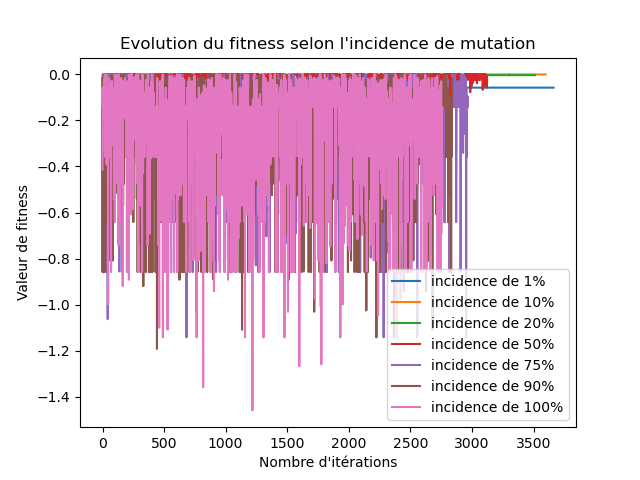

# Préambule

## Introduction

L'intelligence artificielle, dont la popularité n'a fait qu'augmenter au cours des dernières décennies [@cardillo-2023], est aujourd'hui utilisée dans des domaines aussi variés que la médecine, la finance ou même l'agriculture [@marr-2023].

Les algorithmes génétiques font parties de l'ensemble des algorithmes évolutionnistes, inspirés par certains principes biologiques et en particulier de la théorie de l'évolution. Ils permettent de générer une population de solutions potentielles qui va évoluer au fil des générations dans l'optique que les individus soient toujours plus aptes à résoudre le problème donné. [@genetic-algo;@evol-algo]

Les principes de bases sont la reproduction (deux parents donnent des enfants dont la patrimoine génétique est constitué de celui des parents), la mutation (modification aléatoire d'un ou plusieurs gènes) et la sélection (élimination des individus les moins adaptés). 

## Contexte

Il est demandé d'implémenter un algorithme génétique afin de résoudre le jeu "*Le compte est bon*" en Python. Le principe du jeu est le suivant :  A l'aide des nombres entiers de 0 à 9 et des opérateurs mathématiques de base (addition, soustraction, multiplication et division), trouver une suite de nombres et d'opérateurs permettant d'atteindre une cible numérique donnée. 

Chaque individu représente une suite de nombre et d'opérateurs. Un individu est représenté par son chromosome qui est une suite de gènes. Chaque gène représente un nombre, un opérateur ou un gène invalide (qui ne contribue pas au calcul). Chaque gène est encodé par une suite de 4 symboles 1 ou 0 (encodage binaire). 

## Objectifs

Ce document a pour but de décrire le travail effectué ainsi que les choix qui l'y ont mené. 


# Implémentation {#sec:impl}

## Introduction

L'implémentation est intégralement effectuée au sein d'un unique script Python qui a été fourni par l'enseignant au début de travail. Les signatures des fonctions qui étaient initialement présentes n'ont pas été changées. 

La manière dont sont effectuées les opérations génétiques de base (sélection, reproduction et mutation) peut être modifiée à l'aide de plusieurs variables globales. Cette méthodologie permet d'étendre les fonctionnalité du programme sans pour autant changer les signatures proposées. 

## Encodage des individus

La correspondance entre le symbole (nombre ou opérateur) et l'encodage du gène est celle proposée par l'enseignant, à savoir : 

| Symbole | Encodage |
| :-----: | -------- |
|    0    | `0000`   |
|    1    | `0001`   |
|    2    | `0010`   |
|    3    | `0011`   |
|    4    | `0100`   |
|    5    | `0101`   |
|    6    | `0110`   |
|    7    | `0111`   |
|    8    | `1000`   |
|    9    | `1001`   |
|   `+`   | `1010`   |
|   `-`   | `1011`   |
|   `*`   | `1100`   |
|   `/`   | `1101`   |

Dans l'implémentation, chaque individu est alors représenté par son chromosome qui est une **chaîne de caractères**, dont la taille est un multiple de 4. Une population est un ensemble d'individus et est représentée par une liste de chaîne de caractères. 

Les deux codes `1110` et `1111` ne sont pas utilisés et sont considérés comme invalides. 

## Décodage {#sec:decodage}

### Principe

La fonction de décodage permet de convertir un chromosome en une représentation humaine. Celle-ci est constituée de la suite des nombres et des opérateurs encodés par le chromosome, en ignorant les opérations invalides. 

### Opérations invalides

Au fil des reproductions et des mutations aléatoires, des symboles ou des suite d'opérations invalides peuvent apparaitre. Par exemple, les deux codes inutilisés ne sont pas valides. Mais aussi, on considère qu'une suite d'opérations valide est de la forme : 
$$
x_0 \Lambda_1 x_1 \Lambda_2 x_2 \dots x_{n-1}\Lambda_n x_n
$$
Où $x_1\dots x_n$ sont les nombres et $\Lambda_1\dots \Lambda_n$ sont les opérateurs. 

Ainsi, dans le cas où deux nombres ou opérateurs (ou plus) se suivent, l'opération n'a pas de sens. Dans l'implémentation actuelle, la première occurence d'un type de symbole valide est retenue et les symboles invalides suivants sont ignorés jusqu'à ce que l'autre type apparaisse. 

Par exemple, l'opération : 
$$
x_1 \Lambda_1 \Lambda_2 x_2 x_3\Lambda_3
$$
est interprétée de la manière suivante : 
$$
x_1 \Lambda_1 x_2
$$

### Division par zéro 

La division par zéro est également un cas spécial qui risque d'apparaitre et qu'il faut traiter. Afin de simplifier l'implémentation, il a été choisi **d'ignorer** les divisions par zéro. Cela veut dire que cette opération est traitée de la même manière que les opérations invalides. 

Par exemple, l'opération : 
$$
x_1 \Lambda_1 0 \Lambda_2 x_3 \quad, \Lambda_1 \equiv \mbox{ "division"}
$$
Devient :
$$
x_1 \Lambda_2 x_3
$$


### Fonction

La fonction reçoit un chromosome sous forme de chaîne de caractères et retourne le décodage en représentation humaine, également sous forme de chaîne de caractères. Chaque symbole est séparé du suivant par la caractère *espace*. 

## Evaluation

### Principe

L'évaluation du chromosome consiste à obtenir le résultat des opérations (valides) qui le constitue, sous la forme d'un nombre réel. C'est ce résultat qui devra converger vers la cible donnée. 

### Implémentation

La fonction va utiliser le résultat retourné par le décodage (c.f. @sec:decodage). La chaîne de caractère qui est retournée va être divisée à chaque *espace* pour en former une liste. Chacun des éléments de la liste est soit un nombre compris entre 0 et 9 sous forme de caractère, soit un des caractères `+`, `-`, `*` ou `/`. 

Les nombres peuvent être convertis en un entier à l'aide de la fonction Python `int()`. Les opérateurs sont lié à une fonction grâce à un dictionnaire qui permet d'effectuer l'opération correspondante. Le code constituant le dictionnaire est montré dans le @lst:lambda. En cas de division par zéro (qui ne devrait jamais arriver), la fonction division renvoie *NaN*. 

```{#lst:lambda .py caption="Dictionnaire qui fait correspondre l'opérateur à une fonction"}
operations = {
    '+': lambda x, y: x + y,
    '-': lambda x, y: x - y,
    '*': lambda x, y: x * y,
    '/': lambda x, y: x / y if y != 0 else float('nan')
}
```

Chacun des éléments de la liste est donc ainsi interprété et un résultat numérique réel en est obtenu.

## Fitness

### Principe

Une fonction de fitness permet d'évaluer l'efficacité d'une solution. Elle fait correspondre un individu et un score, représenté par un nombre réel. Plus cette valeur est élevée, plus la solution que représente l'individu est efficace.

### Implémentation

La fonction va commencer par évaluer le chromosome pour obtenir la valeur de la solution. Ensuite, l'opposé de la différence entre la valeur de la solution et celle de la cible est retournée. 
$$
\mathrm{fitness}(x, A) = - \left| \mathrm{eval}(x) - A \right|
$$
où $x$ est le chromosome et $A$ est la cible. 

La valeur de fitness d'une solution réduit ainsi **linéairement** par rapport à sa distance à la cible. 

D'autres approches existent, telles que les fonctions quadratiques, exponentielles ou logarithmiques, mais elles n'ont pas été explorées dans le cadre de ce travail. 

## Croisement

### Principe

Le croisement entre deux chromosome consiste à la génération de chromosomes enfants dont le patrimoine génétique est constitué de celui des deux parents. 

### Implémentation

Trois méthodes différentes détaillées dans les paragraphes suivants ont été implémentées. Le croisement retourne toujours exactement deux enfants. Afin de simplifier l'implémentation, il a été décidé de supposer que les deux chromosomes parents sont toujours de taille égale.

#### Découpage en $n$ parties

Le principe est le suivant : Le chromosome de chacun des deux parent est divisé en $n$ parties de taille égale. Ensuite, le premier enfant prend la première partie du premier parent, la deuxième partie du deuxième parent, la troisième partie du premier parent et ainsi de suite. 

C'est la même chose pour le deuxième enfant mais dans l'autre sens. 

#### Echange tous les $n$ bits {#sec:crossnbits}

Au lieu de découper le chromosome en $n$ parties, on découpe le chromosome et on fait un échange tous les $n$ bits. 

#### Echange tous les $n$ gènes

C'est le même principe que la méthode @sec:crossnbits, mais on échange tous les $n$ gènes au lieu des $n$ bits.

### Croisement d'une population

Le croisement de la population consiste à créer une nouvelle génération constituée des enfants de la génération courante. Dans l'implémentation actuelle, à chaque croisement, la taille de la population double. Cela permet de diviser la taille de la population par un facteur 2 lors de la sélection.

Pour effectuer cette opération, une liste contenant l'intégralité de la population est mélangée, puis le premier élément est croisé avec le second, le second avec le troisième et ainsi de suite. Le dernier élément de la liste est croisé avec le premier. 

Cela permet d'effectuer un croisement de population de manière aléatoire, sans pour autant effectuer deux fois le même croisement (sauf si des doublons existent déjà dans la population). Chaque chromosome est donc croisé avec ses deux voisins. 

## Mutation

### Principe

### Inversion de $n$ bits

### Inversion de 1 bit sur $n$ gènes

### Inversion de tous les bits sur $n$ gènes

### Mélange des bits de $n$ gènes

## Sélection

### Principe

### Sélection uniforme

### Sélection par rang

### Sélection par tournois

### Sélection par roulette


***

### Découpage des chromosomes en un nombre n de parties

Cette méthode correspond à la valeur EXCHANGE_X_PARTS. Exemple de valeur de la variable globale:

    CROSSOVER_METHOD = (CrossoverMethod.EXCHANGE_X_PARTS, 4)

Cette méthode va découper les chromosomes en un nombre de partie indiquée dans la variable globale, et échanger entre les deux chromosomes une partie sur deux pour créer les chromosomes finaux. Par exemple, pour la valeur passé en paramètre 4, et les deux chromosomes suivants: "00000000" et "11111111", on obtiendra les enfants suivant:
"00110011" et "11001100".

### Echange tout les n bits
Cette méthode correspond à la valeur EXCHANGE_EACH_X_BIT. Exemple de valeur de la variable globale:

    CROSSOVER_METHOD = (CrossoverMethod.EXCHANGE_EACH_X_BIT, 1)
Cette méthode va échanger les bits une fois sur deux, tout les n nombre de bit (n étant la valeur indiquée dans la variable globale).  
Par exemple, pour la valeur passé en paramètre 1, et les deux chromosomes suivants: "00000000" et "11111111", on obtiendra les enfants suivant:
"01010101" et "10101010".

### Echange tout les n gènes
Cette méthode correspond à la valeur EXCHANGE_EACH_X_GENE. Exemple de valeur de la variable globale:

    CROSSOVER_METHOD = (CrossoverMethod.EXCHANGE_EACH_X_GENE, 1)
Cette méthode va échanger les genes une fois sur deux, tout les n nombre de genes (n étant la valeur indiquée dans la variable globale).  
Par exemple, pour la valeur passé en paramètre 1, et les deux chromosomes suivants: "0000000000000000" et "1111111111111111", on obtiendra les enfants suivant:
"0000111100001111" et "1111000011110000".

## Mutation d'un chromosome
La mutation d'un chromosome consiste à modifier son contenu.  
Nous avons pour cette étape 4 méthodes. Toutes ces méthodes dépendant d'un algorithme de pseudo aléatoire déjà implémenté dans le langage python.
La méthode utilisée est choisie en utilisant la variable globale MUTATION_METHOD, qui consiste en un tuple, avec comme première valeur, la méthode choisie, et en deuxième valeur, le paramètre de la méthode (une valeur entière).  
### Inversion de n bits
Cette méthode correspond à la valeur INVERT_X_BIT de l'énumération. Exemple:

    MUTATION_METHOD = (MutationMethod.INVERT_X_BIT, 4)
Cette méthode va choisir de manière aléatoire n bits du chromosome (ou n est la deuxième valeur de la variable globale), et les inverser, c'est à dire faire passer 1 à 0, et 0 à 1. Par exemple, pour le chromosome "11111111" avec la valeur n=4, on pourrait obtenir: "10110010" (Les index 1,4,5,7 ont été inversés).

### Inversion de 1 bits pour n gènes
Cette méthode correspond à la valeur INVERT_ONE_BIT_OF_X_GENES de l'énumération. Exemple:

    MUTATION_METHOD = (MutationMethod.INVERT_ONE_BIT_OF_x_GENES, 2)
Cette méthode va choisir de manière aléatoire n gènes du chromosome (ou n est la deuxième valeur de la variable globale), et inverser un bit choisi aléatoirement pour chacun. Par exemple, pour le chromosome "1111000011110000" avec la valeur n=2, on pourrait obtenir: "1011000011110010" (Les index 1 et 14 dans les gènes 0 et 3 ont été inversés).

### Inversion de tout les bits de n gènes
Cette méthode correspond à la valeur INVERT_ALL_BITS_OF_X_GENES de l'énumération. Exemple:

    MUTATION_METHOD = (MutationMethod.INVERT_ALL_BITS_OF_X_GENES, 2)
Cette méthode va choisir de manière aléatoire n genes du chromosome (ou n est la deuxième valeur de la variable globale), et inverser tout leurs bits. Par exemple, pour le chromosome "1111000011110000" avec la valeur n=2, on pourrait obtenir: "1111111100000000" (Les 2ème et 3ème gènes ont été inversés).

### Mélange de tout les bits de n gènes
Cette méthode correspond à la valeur SCRAMBLE_ALL_BITS_OF_X_GENES de l'énumération. Exemple:

    MUTATION_METHOD = (MutationMethod.SCRAMBLE_ALL_BITS_OF_X_GENES, 2)
Cette méthode va choisir de manière aléatoire n genes du chromosome (ou n est la deuxième valeur de la variable globale), et mélanger de manières aléatoire tout leurs bits. Par exemple, pour le chromosome "1001100110011001" avec la valeur n=2, on pourrait obtenir: "1100100101101001" (Les 1er et 3ème gènes ont été mélangés).

## Sélection dans une population
Cette étape permet de sélectionner la partie de la population que l'on va garder pour la suite de l'algorithme. Dans notre implémentation, nous gardons la moitié de la population donnée.
Il y a 4 méthode, et un mode élitiste à activer ou désactiver.
La méthode utilisée est choisie en utilisant la variable globale SELECTION_METHOD, qui consiste en un tuple, avec comme première valeur, la méthode choisie, et en deuxième valeur, un booléen indiquant si l'on active (True) le mode élitiste ou non (False).

### Le mode élitiste
Le mode élitiste consiste à toujours garder dans la population la meilleure solution trouvée. Cela permet de ne pas divergé totalement d'une bonne solution. Ce mode complète les méthodes expliqué ensuite s'il est activé.

### La sélection uniforme
Cette méthode correspond à la valeur UNIFORM de l'énumération. Exemple: 

    SELECTION_METHOD = (SelectionMethod.UNIFORM, True)
La méthode de sélection uniforme consiste en la sélection de manière aléatoire de la population. Pour cela, on utilise l'algorithme de pseudo-aléatoire de python pour mélanger un tableau contenant la population, puis on sélectionne la première moitié du tableau.

### La sélection par rang
Cette méthode correspond à la valeur RANK de l'énumération. Exemple: 

    SELECTION_METHOD = (SelectionMethod.RANK, True)
La méthode de sélection par rang consiste en la sélection des meilleures chromosome. Pour cela, on tri la population selon leur résultat à la fonction de fitness, et on prend la moitié avec le meilleur résultat.

### La sélection par tournoi
Cette méthode correspond à la valeur TOURNAMENT de l'énumération. Exemple: 

    SELECTION_METHOD = (SelectionMethod.TOURNAMENT, True)
La méthode de sélection par tournoi consiste en l'organisation d'un sorte de tournoi, donc on garde les chromosomes ayant gagné leur match. Pour cela, on crée de manière aléatoire des paires avec tout les chromosomes, et on ne garde que le chromosome avec le meilleur résulat à la fonction de fitness pour chaque paire.

### La sélection par roulette
[//]: # (TODO)


## Génération d'une population initiale
Cette méthode n'a pas été modifiée, et correspond donc à la version originale qui se trouvait dans le modèle de départ

## L'algorithme génétique
Cette méthode n'a pas été modifiée, et correspond donc à la version originale qui se trouvait dans le modèle de départ

# Analyse

## Introduction

Comme vu dans la @sec:iml, plusieurs méthodes ont été implémentées, que ce soit pour la mutation, la sélection ou le croisement. De plus, chacune d'entre elles peuvent être ajustées avec un ou plusieurs paramètres. 

Dans cette section, les différentes fonctionnalités sont évaluées afin d'en déduire les méthodes et les paramètres les plus efficaces. 

Etant donné la quantité de réglages possibles, il n'est pas possible de tester toutes les méthodes avec tous les paramètres possibles en même temps sur un même référentiel. On se retrouverait avec des centaines de graphes différents qui deviendraient alors illisibles.

Alors, des méthodes et des paramètres standards fixes ont été définis, puis chacun d'entre eux va être modifié, l'un après l'autre, et le résultat sera analysé. De cette manière, une seule variable est analysée à chaque fois. 

## Paramètres standards

| Paramètre             | Valeur                                                   |
| --------------------- | -------------------------------------------------------- |
| Cible                 | $\pi$                                                    |
| Méthode de mutation   | Inversion de 1 bit sur 5 gènes avec une incidence de 30% |
| Méthode de sélection  | Tournoi élitiste                                         |
| Méthode de croisement | Echange de 4 parties                                     |
| Nombre de gènes       | 30                                                       |
| Taille de population  | 50                                                       |
| Limite de temps [s]   | 10                                                       |

## Méthode de mutation

### Introduction

Dans cette section, les trois méthodes de mutations sont testées et analysées.

### Résultats

#### Méthode

Sur la @fig:plot-mutation-method est représentée l'évolution de la valeur de fitness du meilleur individu en fonction du nombre d'itérations, selon la méthode de mutation utilisée. 

On en déduit que les méthodes les plus efficaces sont l'inversion de 5 bits ou d'un bit sur 5 gènes. 

La mutation trop importante du chromosome fait fortement varier l'efficacité de la population ou l'empêche de s'améliorer.

{#fig:plot-mutation-method}

#### Nombre de gènes affectés

Sur la @fig:plot-mutation-x est représentée l'évolution de la valeur de fitness du meilleur individu en fonction du nombre d'itérations, selon le nombre de gènes affectés par la mutation. 

On remarque clairement qu'un trop grand nombre de gènes mutés font drastiquement varier la performance des individus (en rouge), tandis qu'un trop faible nombre de gènes mutés font stagner la performance à une valeur inférieure (en bleu). 

On en conclut que la meilleure stratégie est de muter environ 10% des gènes. 

{#fig:plot-mutation-x}

#### Incidence

Sur la @fig:plot-mutation-i est représentée l'évolution de la valeur de fitness du meilleur individu en fonction du nombre d'itération, selon le taux d'incidence de mutation. Ce chiffre correspond à la probabilité qu'a un chromosome d'être muté. 

On remarque qu'un trop grand nombre de chromosome mutés (> 75%) implique une forte variation de la performance. 

Il faut donc que le taux de mutation reste inférieur à 50% pour de meilleurs résultats.

{#fig:plot-mutation-i}

### Discussion & choix


## Méthode de sélection

### Introduction

### Résultats

#### Sélection uniforme

Sur la @fig:plot-selection-uniform est représentée l'évolution de la valeur de fitness du meilleur individu en fonction du nombre d'itérations avec la sélection uniforme. 

{#fig:plot-selection-uniform width=10cm}

#### Sélection par rang

Sur la @fig:plot-selection-rank est représentée l'évolution de la valeur de fitness du meilleur individu en fonction du nombre d'itérations avec la méthode de sélection par rang.

{#fig:plot-selection-rank width=10cm}

#### Sélection par tournoi

Sur la 

{#fig:plot-selection-tournament-e width=10cm}


#### Sélection par roulette


### Discussion & choix

## Méthode de croisement

### Introduction

### Résultats


### Discussion

## Nombre de gènes

### Introduction

### Résultats


### Discussion

## Taille de la population

### Introduction

### Résultats


### Discussion

# Conclusion

## Travail effectué

## Limitations

## Perspectives


\listoffigures

\listoftables

\listoflistings


# Bibliographie {-}

\printbibliography